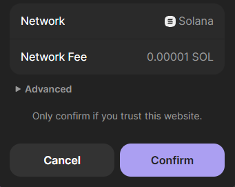
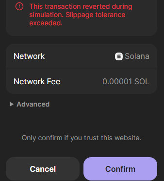
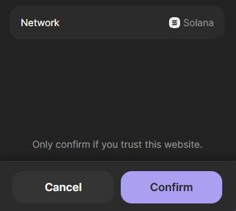
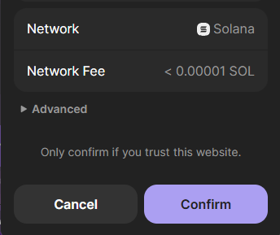
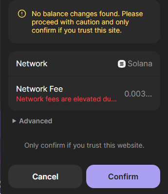
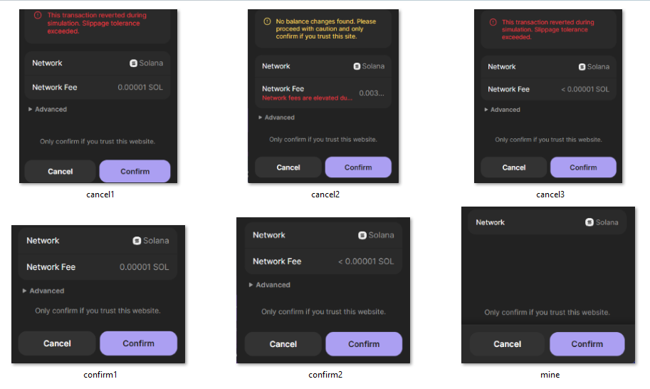

# Windows-PyAuto-Auto-Clicker
Use this script for automating clicks on a Windows PC. Script is setup for wallet confirmations or cancels depending on users saved screenshots. 

Images in this repository will not work for your setup and are intended for example and reference purposes only. You must take your own screenshots using your main monitor (must be monitor 1 in multi monitor setups).

# PyAutoGUI Pond0x Automation Script

## Overview

This PyAutoGUI automation script was specifically designed for **Pond0x crypto swapping and starting the crypto miner**. It automatically detects and clicks on various popup windows that appear during cryptocurrency transactions and mining operations, eliminating the need for manual intervention.

## Purpose and Functionality

### Primary Use Case: Pond0x Operations
- **Automated Transaction Confirmations**: Automatically clicks wallet popups to confirm or cancel swap transactions between cryptocurrencies (e.g., SOL to wPOND)
- **Mining Session Management**: Automatically clicks wallet popups to start crypto mining sessions
- **Error Handling**: Manages common errors like slippage tolerance exceeded, network fee notifications, and insufficient balance warnings
- **Multi-popup Support**: Handles various popup types with customizable confirm/cancel actions

### How It Works
1. **Image Recognition**: Uses OpenCV and PyAutoGUI to scan the screen for predefined popup images
2. **Smart Clicking**: Automatically clicks the appropriate button (Confirm or Cancel) based on popup type
3. **Offset Calibration**: Uses adjustable X/Y offsets to ensure accurate button clicking
4. **Real-time Monitoring**: Continuously scans the screen for new popups
5. **GUI Control Panel**: Provides a user-friendly interface for starting/stopping and adjusting settings

## Key Features

- **Multiple Image Support**: Handles up to 11 different popup types simultaneously
- **High-DPI Compatible**: Includes scaling adjustments for high-DPI Windows displays
- **Safety Features**: Built-in fail-safe (move mouse to upper-left corner to abort)
- **Error Recovery**: Continues operation even when individual images can't be found
- **Customizable Offsets**: Fine-tune click positions for different popup layouts
- **Real-time Feedback**: Console logging shows detection and click activities

## System Requirements

- **Operating System**: Windows 10 or Windows 11
- **Python**: 3.11.1 or higher
- **Dependencies**:
  - `pyautogui` - Screen automation and image recognition
  - `opencv-python` - Enhanced image processing capabilities
  - `tkinter` - GUI control panel (included with Python)

## Installation

### Install Python Dependencies
```cmd
pip install pyautogui
pip install pillow
pip install opencv-python
```

### Windows-Specific Setup
1. **Run as Administrator**: For best compatibility, run the script as administrator
2. **Windows Defender**: Add script folder to Windows Defender exclusions if needed
3. **Display Settings**: Ensure display scaling is consistent across monitors

## File Structure

```
C:\PyAutoGUI\
├── Win-auto-clicker.py          # Main script file
├── mine.png                     # Mining confirmation popup
├── confirm1.png                 # Primary transaction confirmation
├── confirm2.png                 # Network fee confirmation
├── confirm3.png                 # Additional confirmation popup
├── confirm4.png                 # Additional confirmation popup  
├── confirm5.png                 # Additional confirmation popup
├── cancel1.png                  # Slippage error popup
├── cancel2.png                  # Balance insufficient popup
├── cancel3.png                  # Additional cancel popup
├── cancel4.png                  # Additional cancel popup
└── cancel5.png                  # Additional cancel popup
```

## Security and Safety

### Built-in Safety Features
- **Fail-safe Mechanism**: Move mouse to upper-left screen corner to immediately stop
- **Screen Bounds Checking**: Prevents clicking outside visible screen area
- **Error Handling**: Graceful handling of image loading and detection failures
- **Manual Override**: GUI stop button for immediate termination

### Important Security Notes
⚠️ **WARNING**: This script will automatically click on ANY popup that matches your saved screenshots across all your monitors. Only use when actively performing Pond0x operations.

## Configuration

### Setup
# Wallet Transaction Auto Clicker for Windows
python script using PyAutoGUI to see and act on user submitted screenshots for confirming or canceling wallet transaction popups. Built for automation of Pond0x particicpation

## !!!REMEMBER!!!

## The pyautogui script WILL click ALL confirm images that match your screen shots for the ENTIRE monitor.

## IF YOU ARE NOT USING IT FOR AUTO MINING/SWAPPING TURN IT OFF!!!!


If you are using the extension "EzmodeV2" to automate your participation on [Pond0x](https://www.pond0x.com/)} you do not need the secondary auto clicker. You can skips steps 8, 9, and 11.

Python Download Windows

https://www.python.org/ftp/python/3.13.2/python-3.13.2-amd64.exe

Check the box that says "Add Python to PATH" (super important!) during install.

pip install pyautogui
pip install pillow
pip install opencv-python

.
Windows PyAutoGUI Error Handling Script

https://x.com/i/grok/share/ShKKlqR7tLQLThpdFn1Ma7Fdn

# Step 1

*If you're running the previous version of pyautogui script this should be done already.*

Download and install Python from python.org
on install window click the box that says "add python.exe to path"
then begin install process
you do not need to disable character length

# Step 2
open Windows command prompt
if you dont know where it is:
press windows key + S
type in "command" and select the command prompt at the top of the list


# Step 3
*If running the previous version of the pyautogui script this is done already.*

once Command Prompt is open we will now install PyAutoGUI and the required tools. (all three commands are above for easy copy paste)
first we will type in  or paste the "pip install pyautogui" and press enter
once complete move on to next install command
next we will type in "pip install pillow" and press enter
once complete move to final install command
last we will type in "pip install opencv-python" and press enter

depending on your system some of the packages may require an update. if prompted run the command it gives you.


# Step 4

*If you're running the previous version of pyautogui script this should be done already.*

We will now make a file to save the script and images of your pop-ups.
open file explorer
left hand side of screen you should see a list of locations click "This PC" then "Local Disk (C:)"  then "Users" then you should have a file that is the name of your computer, typically it is your username or a portion of your username, click it.
now right click and create a new folder. We will call this folder "Pyautogui"

# Step 5
Open a blank Notepad document.

Travel to the following grok conversation
https://x.com/i/grok/share/ShKKlqR7tLQLThpdFn1Ma7Fdn


scroll down on the conversation until you see the colored text. This the script you need to copy.
there is a little copy icon in the right corner of the  conversation  (click it).

now go back to the notepad document you opened and paste the script there.

we need to modify a portion of the script before we save it.
from the top of the page count down 3 hashtags (#) you should see the following text

`# Base directory for images (Windows path)
BASE_DIR = "C:\\Users\\YourUsername\\Pyautogui\\`


where it says "YourUsername" delete that section and replace it with your user name. (your username is the folder we opened to create and save the Pyautogui folder in Step 4.

example: my user name is joek so my text should read>

`# Base directory for images (Windows path)
BASE_DIR = "C:\\Users\\joek\\Pyautogui\\`

Next we will go to file and save as. travel to the Pyautogui folder we created in step 4 inside the popup window that appears.
we will name the file "Win-auto-clicker.py". under where we typed the file name there is a box that should say .txt (text) click it to open a drop down menu and select "all files"

now click save. 

travel to the folder we created in step 4 and confirm the file has been saved there.


# Step 6
now we will create take a few screen shots of the Phantom popup windows.

travel to Pond0x.com and perform a swap of Sol to wPOND. DO NOT CONFIRM THE TRANSACTION
once you have the popup on screen using your keyboard press windows + shift + S to open the snip tool
take your cursor over to the popup , click and hold, then drag a box around the area seen in the image with this message.
if you see a popup to open the screen shot do so.
if not, open your file explorer and go to your "photos" and look for a folder titled screenshots. right click the icon and select open with and select the snipping tool.
once open you can further crop the image to trim down excess borders not seen in the example image. 

click the save icon and travel to the pyautogui folder we created in step 4 save the file as "confirm1.png"




check the folder to ensure the image is now saved there

this step can be performed with any wallet that you are using. 

IMPORTANT NOTE: once this script is started it will approve ANY and ALL popups that match your images. If you are not using the auto swapper TURN OFF THE SCRIPT!

The next image we are going to grab will be off the slippage tolerance exceeded popup.

in order to force this image we will adjust our slippage to Fixed and a value of 0.01% and use $SOL>USDC.

once we do that we can repeat the above actions. Cancel and retry until you see the image in this message. we will call this image cancel1.png




Finally we will now grab the popup for the xminer when we start a mining session.

Again follow the steps at the beginning of this section to capture the screen shot except you will start a mining session and use the confirm popup that appears. you will want it to look like the example in this message.

we will call this "mine.png"




Additionally you will encounter other popups that are not listed here. you will want to grab screen shots of them and save them.  the first image you will notice a < symbol in the network fee section. you will want to save this one as "confirm2.png". The other is a no balance found error message, This one will need to be saved as cancel2.png. these are both built into the script and after saving will be handled appropriately.

 


Any other popups that appear will cause the script to pause, making it easy to grab them. if you encounter one, and after grabbing the image and cropping to look similar to the other examples here you can save it as either:
(if you want confirm clicked)
confirm3.png 
confirm4.png
confirm5.png
(if you want cancel clicked)
cancel3.png
cancel4.png
cancel5.png

This gives you a little customization ability to help the script work for you. If you run out of image slots then let us know and we can help you with adding more to the script.

Additional images I have so far.




# Step 7

*If you're running the previous version of pyautogui script this should be done already.*

now we will create a command cheat sheet for you to reference when you need to start the auto clicker script

open a new notepad document and paste the commands in the following message.

*If you are using the old pyautogui script you will have two run commands now, autoswap.py and Win-auto-clicker.py. this is so if you do not get the newest one running immediately you can still revert back to and use the old one.*

cd C:\Users\YourUsername\PyAutoGUI

python Win-auto-clicker.py


after pasting those commands into the fresh notepad document you will change the section that says "YourUsername" to be your username just like we did in step  5.

then save as, name it cheat sheet, and put it into pyautogui folder

# Step 8

### Skip if running EzmodeV2 Extension 
.
we now need to download an auto clicker if you do not have one.
We have found that OP Auto Clicker works well and is a free download.

OP Autoclicker 
https://www.opautoclicker.com/

download and install

# Step 9
### Skip if running EzmodeV2 Extension 
.
once we have an auto clicker installed we are now ready to begin setting up our pond0x swap browser.
open an internet browser that has your wallet installed as an extension.
travel to pond0x.com/swap.
Set browser window zoom to 75%

A few notes:
1- I start my browser size from the "swap again" button position. This is the largest swap console area.
2- The white Pond0x banner at the top of the page is just above the usdc about where it says "you pay"
3- Take note how I have aligned the bottom of the browser just below the purple area of the swap console The reason for this is when the ui glitches and I need to refresh it I know exactly where I need to scroll down to so my auto clicker continues to click the "swap" and "swap again" buttons accurately.
4- Place the browser window towards the top of your screen.
5- If you have multiple monitors you may encounter issues with the script finding the confirm button. to minimize this place the browser window on you number 1 or main monitor


# Step 10
set up your swap settings. use your own personal judgement. i am personally using:
max cap
ultra
0.000007
fixed
1%

make sure you save the settings by scrolling down and clicking save.

You can test if a token pair is eligible for swap boost by making a swap and then referencing your manifest data either through dev tools on the website or Carys manifest dashboard.

i have seen as low as a $0.001 usdc swap to sol count towards swap boost. make your own personal judgement and set a value you wish to swap with.

load you wallet with sufficient funds. the way phantom ( i can not speak for other wallets) works that when you run out of either token in your swap pair it does not generate a confirm button thus once your out of funds it will stop swapping. the script will continue to run and the auto clicker will continue to click but nothing should happen.


# Step 11
### Skip if running EzmodeV2 Extension 
.
open your auto clicker we will be specific to op auto clicker here. adjust to fit your specific clicker program.
set "click repeat" to "repeat until stopped"
click the circle to toggle on "set location"
now go back to your browser and to pond0x.com/swap
make a swap and stop on the popup where the  confirm button is visible.  do not click confirm.
we need to reference the location of the popup to the purple swap button that now should be partially hidden. 
when the Phantom pop-up appears the cursor needs to be hovering over top of the popup in a place that doesn't do anything aka dead space. Your auto clicker will continue to run while this is visible and if it clicks outside the popup or on a clickable box within the popup before 
 has a chance to click confirm the popup will be hidden or you will be redirected and your auto swapper will stall.
in my experience with the above browser setup your cursor should be able to be placed somewhere around the words "network fee" and if the popup is gone it will be on the swap button. ( be aware that there is a clickable section directly below this area)
when we set the auto clicker it will engage the swap button so it needs to land on that if the popup is gone.

once you find a suitable location return to OP and click the box that says "pick location"

your op auto clicker window will disappear now take your cursor and click one time in the location on the popup that you found is dead space and will land on the "swap" button.

once you click once the op window will return and there will now be coordinates listed in the x,y boxes.

# Step 12
Now lets start your script!

open command prompt, and your command cheat sheet. (dont forget we changed the "YourUsername" this is an example)

copy the first line of the cheat sheet > 

cd C:\Users\YourUsername\PyAutoGUI

paste it into your prompt by right clicking in the terminal window. and press enter
the text should now read > C:\Users\YourUsername\PyAutoGUI>

Next copy the second line of the cheat sheet > 

python Win-auto-clicker.py

paste it into your terminal and press enter.

it should now begin printing a response 

Screen size: 1920x1080 pixels
Attempting to initialize Tkinter...
Tkinter initialized successfully.
Start button created
Stop button created
Starting Tkinter mainloop...

if so then the script is running as intended and you should now have a control panel on screen.

The script will print error messages for the missing images. This is normal, as you encounter and save the popup images these will disappear.

if you receive any other error copy the error and paste it into grok or tag myself or Bearly and we will help you trouble shoot.

# Step 13
minimize the command prompt window.
bring back your pond0x browser window and the new Autoclicker control panel.

on the new control panel you will notice that there are two sections to adjust x and y coordinates for the confirm offsets and the cancel offsets. these are the button locations.

Before you can run the  auto clicker without worry, you will need to fine tune these values to ensure it clicks accurately on each style button. simply stop the clicker with the stop button change the value in x for horizontal direction or y for vertical direction. use small increments probably no more than 5 at a time to get it just right. Do not run the extension while you are doing this. Simply manually process transactions through.

to fine tune the cancel button apply the same settings as you did to force the popup you grabbed the image from in step 6.

Once you have them set, return to your cheat sheet and record the confirm and cancel x,y coordinates. You will need to re enter these everytime you restart the autoclicker program after you close the window.

Congratulations you are now ready to press start and begin your automation journey. 

To end the Autoclicker program simply close the control panel window or close command prompt.

To restart simply open command prompt and your cheat sheet, copy paste each command line into the terminal one at a time and hit enter after each. Once the Autoclicker control panel is on screen re enter your saved coordinates from the cheat sheet and your ready to press start.

## !!!REMEMBER!!!

## The pyautogui script WILL click ALL confirm images that match your screen shots for the ENTIRE monitor.

## IF YOU ARE NOT USING IT FOR AUTO MINING/SWAPPING TURN IT OFF!!!!


### Windows Display Configuration
- **Multiple Monitors**: Ensure primary monitor is set correctly in Windows Display Settings
- **Display Scaling**: Use consistent scaling across all monitors (100%, 125%, 150%, etc.)
- **Resolution**: Higher resolution screenshots provide better recognition accuracy

### Advanced Configuration
- **Confidence Level**: Adjust image recognition sensitivity (default: 0.9)
- **Scan Delay**: Modify scanning frequency (default: 0.2 seconds)
- **Click Delay**: Adjust pause after clicking (default: 2 seconds)
- **DPI Scaling**: Configure for different Windows display scaling settings

## Other Potential Use Cases

While designed specifically for Pond0x, this script framework can be adapted for other automation scenarios:

### General Applications
- **Web Application Testing**: Automate clicking through web app workflows
- **Game Automation**: Handle repetitive clicking in browser or desktop games  
- **Software Installation**: Automate installer wizards and license agreements
- **Data Entry Tasks**: Speed up forms that require frequent confirmations
- **System Maintenance**: Automate routine popup dismissals during Windows updates

### DeFi and Crypto Applications
- **Multi-DEX Trading**: Adapt for other decentralized exchanges
- **Yield Farming**: Automate reward claiming across multiple platforms
- **NFT Minting**: Handle high-frequency minting operations
- **Liquidity Pool Management**: Automate LP token staking/unstaking
- **Cross-chain Bridging**: Manage bridge transaction confirmations

### Business Process Automation
- **Batch Processing**: Handle confirmation dialogs in data processing workflows
- **Report Generation**: Automate report export confirmations
- **Email Marketing**: Handle bulk sending confirmations
- **Customer Support**: Automate ticket system interactions

### Development and Testing
- **QA Testing**: Automated UI testing for popup-heavy applications
- **Deployment Automation**: Handle deployment confirmation dialogs
- **Database Operations**: Automate backup/restore confirmations
- **Server Management**: Handle system administration prompts

## Customization Guidelines

### Adding New Popup Types
1. **Capture Screenshot**: Use Windows Snipping Tool (Windows + Shift + S)
2. **Crop Image**: Remove excess borders, focus on popup content
3. **Save as PNG**: Use `confirm#.png` or `cancel#.png` naming convention
4. **Update Script**: Add new image to `IMAGE_CONDITIONS` array if needed

### Modifying Click Behavior
```python
# Example: Add new popup type
{"name": "newpopup.png", "action": "confirm"}  # or "cancel"
```

### Adjusting Performance
```python
# Scan frequency (lower = faster, higher CPU usage)
time.sleep(0.2)  # Current setting

# Image recognition sensitivity
confidence=0.9   # Range: 0.1 to 1.0
```

## Windows-Specific Troubleshooting

### Common Windows Issues
- **Permission Errors**: Run Command Prompt or PowerShell as Administrator
- **Windows Security**: Add script folder to Windows Defender exclusions
- **UAC Prompts**: Consider running with elevated privileges for system-level automation
- **Images Not Found**: Verify screenshot format (PNG recommended) and file paths
- **Wrong Click Positions**: Recalibrate offsets, check Windows display scaling
- **High CPU Usage**: Increase scan delay interval, close unnecessary background apps

### Windows Display Issues
- **Multi-Monitor Setup**: Ensure script targets correct monitor (primary display)
- **DPI Scaling Problems**: Use consistent scaling across all displays
- **Resolution Changes**: Retake screenshots if display resolution changes
- **Window Focus Issues**: Ensure target windows are in foreground

### Performance Optimization
- **Windows Performance Mode**: Set to "Best Performance" in Power Options
- **Background Apps**: Close unnecessary applications to reduce CPU load
- **Antivirus Exclusions**: Add script directory to antivirus exclusions
- **Visual Effects**: Disable Windows visual effects for better performance

## Windows File Path Examples

### Recommended Directory Structure
```
C:\PyAutoGUI\                    # Main script directory
C:\Users\%USERNAME%\Pictures\Screenshots\  # Alternative location
D:\AutoClicker\                  # Secondary drive option
```

### Environment Variables
```python
import os
BASE_DIR = os.path.join(os.environ['USERPROFILE'], 'PyAutoGUI')
```

## Contributing

To extend functionality or fix issues:
1. Test changes with non-production popups first
2. Maintain backward compatibility with existing image files
3. Document any new Windows-specific configuration requirements
4. Consider Windows security implications of automated clicking
5. Test across different Windows versions (10, 11)

## License and Disclaimer

This script is provided for educational and automation purposes. Users are responsible for:
- Ensuring compliance with terms of service of automated platforms
- Understanding security implications of automated clicking on Windows systems
- Proper testing before production use
- Monitoring script behavior during operation
- Compliance with Windows security policies

**Use at your own risk. The script will click on matching popups across all your Windows monitors.**

## Windows-Specific Notes

- **Administrator Rights**: Some system-level popups may require elevated privileges
- **Windows Updates**: Script may be interrupted by Windows Update notifications
- **Sleep Mode**: Configure power settings to prevent system sleep during operation
- **Network Drives**: Avoid storing images on network drives for better performance
- **Firewall**: Windows Firewall may prompt for network-related automation scripts

